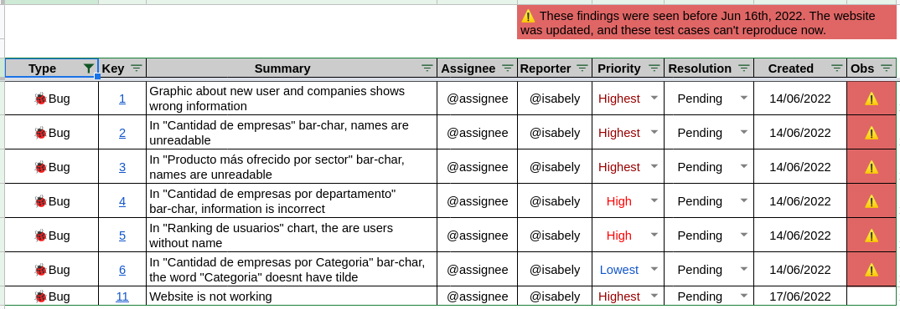

# Manual Testing

Apply Manual Testing to the Indicator Dashboard feature of **Compra Lo Nuestro**, a White Label of Connect Americas. In order to verify that is according to the created and comply with the client requirements.

Credentials for this test are not shared in this repository.

## Files in this repository

The files in this repository are organized as shown in the image below.
Bug reports are in a public `Spreadsheet` file, share in the [Bug Report section](https://github.com/isabelyb/QA-Assessment/tree/manual#3-bug-reports).

# Tester requirements

## 1. Exploratory Testing

Exploratory testing is a method to test the software, in which tests are not pre-defined. Therefore, those tests are designed, executed, logged, and evaluated during the evaluation, and its results allow learning more about the software tested and the creation of more tests in case necessary.

Exploratory testing is most used when:
* There is not time enough to test all functionalities
* To complement other more formal testing techniques.
* There are not documentation and specifications enough about the software

Sources:

* [Foundation Level (CTFL) Syllabus - ISTQB](https://istqb-main-web-prod.s3.amazonaws.com/media/documents/ISTQB-CTFL_Syllabus_2018_v3.1.1.pdf)
* [Exploratory testing - Atlassian](https://www.atlassian.com/continuous-delivery/software-testing/exploratory-testing)

## 2. Test Cases

Test cases in `Gherkin` for "Cantidad de Empresas" section:

* [By Sector](testCases/byCompanies/bySector.feature)
* [By Department](testCases/byCompanies/byDepartment.feature)
* [By Category](testCases/byCompanies/byCategory.feature)

It is possible to do all in one test using an `Scenario outline`:

* [By Companies - Scenario outline](testCases/byCompanies.outline.feature)

## 3. Bug Reports

Most of the time, finding Bugs in testing process means that those situations wont reach the client and the development team can fix them before release a product. 

### 🐞 [Here the entire bug reports](https://docs.google.com/spreadsheets/d/1u1QKv56hdA59uOP3MtTf8VhnrHuEM0kol_1WWiRWHFI/edit?usp=sharing)

## 4. Improvements to the dashboard

Improvements are findings encountered in the exploratory test, that not block the use of the product. But fix them improve the quality of the product.

  
**Error 503:** This is a very common situation with this website, that is mean the user watch this screen a lot of times. A friendly message can be a difference in product perception of the client.

### ✨ [Here the entire improvement reports](https://docs.google.com/spreadsheets/d/1u1QKv56hdA59uOP3MtTf8VhnrHuEM0kol_1WWiRWHFI/edit?usp=sharing)  

## 5. Conclusions
* Exploratory testing is the principal technique when the documentation is not enough to know the application and when it is necessary to complement the testing process.

* In the CLN project, two situations were found that did not permit a complete testing process in the designated time:

    * First, the cache works intermittently, doing difficult to test the website because of its availability.

    * Second, an iterative website needs to maintain the testing processes, but it is important to accord with the development team the times for these tasks. In this case, this is an exercise and there are no relevant consequences but in the productive day-to-day, this situation can represent a loss of resources as the tester time, in other words, money.

    * Despite, those difficulties the site was tested and the dashboard analyzed and some findings were  encountered. 
    Numbers are fundamental to make decisions, this is an important feature, and it is necessary to comply the client's requirement because a a difference in the data-visualization can become a bias to affect in the decision taking process.

* It is very important to have evidence of all findigs found, to permit its reproducibility, and in consequence to work in the solution o improvement.

* Finally, but not less important it is to understand the objective of every tester is orienting their actions to guarantee, in the possible, the product complies with the client and design requirements, and finally, the product serves for the reason has been created.

---
[Come back to *main* branch](https://github.com/isabelyb/QA-Assessment/tree/main)