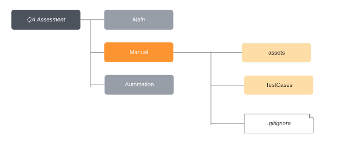

# Manual Testing

Apply Manual Testing to the Indicator Dashboard feature of **Compra Lo Nuestro**, a White Label of Connect Americas. In order to verify that is according to the created and comply with the client requirements.

Credentials for this test are not shared in this repository.

## Files in this repository

# Tester requirements

## 1. Exploratory Testing

Exploratory testing is a method to test the software, in which tests are not pre-defined. Therefore, those tests are designed, executed, logged, and evaluated during the evaluation, and its results allow learning more about the software tested and the creation of more tests in case necessary.

Exploratory testing is most used when:
* There is not time enough to test all functionalities
* To complement other more formal testing techniques.
* There are not documentation and specifications enough about the software

## 2. Test Cases

Test cases in `Gherkin` for "Cantidad de Empresas" section:

* [By Sector](testCases/byCompanies/bySector.feature)
* [By Department](testCases/byCompanies/byDepartment.feature)
* [By Category](testCases/byCompanies/byCategory.feature)

It is possible to do all in one test using an `Scenario outline`:

* [By Companies - Scenario outline](testCases/byCompanies.outline.feature)

## 3. Bug Reports

This is the entire file with the bug reports: 

🐞 [Here the bug reports](https://docs.google.com/spreadsheets/d/1u1QKv56hdA59uOP3MtTf8VhnrHuEM0kol_1WWiRWHFI/edit?usp=sharing)

## 4. Improvements to the dashboard

## 5. Conclusions

Source:

* [Foundation Level (CTFL) Syllabus - ISTQB](https://istqb-main-web-prod.s3.amazonaws.com/media/documents/ISTQB-CTFL_Syllabus_2018_v3.1.1.pdf)
* [Exploratory testing - Atlassian](https://www.atlassian.com/continuous-delivery/software-testing/exploratory-testing)

---
[Come back to *main* branch](https://github.com/isabelyb/QA-Assesment/tree/main)